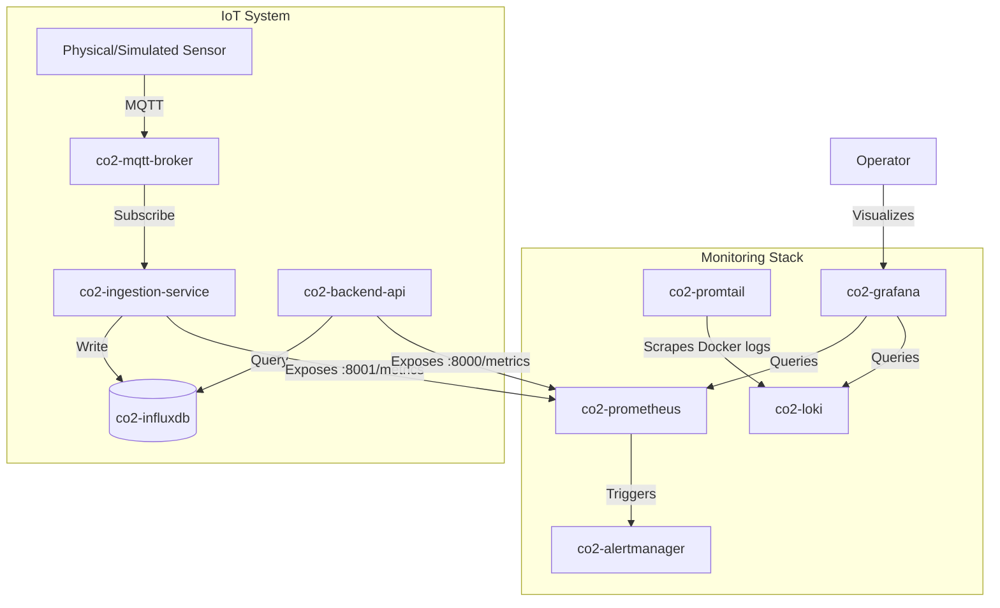

# Phase 11: Monitoring Stack

This folder contains the complete, production-grade monitoring stack for the **Hybrid IoT-LSTM CO₂ Ventilation System**. The stack integrates **Prometheus** for metrics collection, **Grafana** for real-time visualization, **Alertmanager** for incident response, and **Loki + Promtail** for log aggregation.

---

## Architecture Overview

The monitoring stack is designed to scrape metrics and collect logs from all running system services. Below is a diagram illustrating the flow of telemetry data and logs:



---

## Monitoring Stack Services

1. **Prometheus** (Port `9090`): Time-series database that scrapes metrics from the API and Ingestion containers.
2. **Alertmanager** (Port `9093`): Dispatches alerting notifications based on configured Prometheus rules.
3. **Loki** (Port `3100`): Log aggregation database.
4. **Promtail**: Log shipper agent that mounts the Docker socket and forwards container logs to Loki.
5. **Grafana** (Port `3000`): Visual dashboard preconfigured with custom data sources and a comprehensive telemetry panel.

---

## Custom Prometheus Metrics

The system exposes the following custom metrics via standard Prometheus instrumentation:

| Metric Name | Type | Labels | Description | Exporter |
|-------------|------|--------|-------------|----------|
| `co2_level_ppm` | Gauge | `device_id` | Current CO₂ level in PPM. | Ingestion Daemon (`:8001`) |
| `co2_readings_total` | Counter | `device_id` | Total number of CO₂ readings processed. | Ingestion Daemon (`:8001`) |
| `ventilation_relay_status` | Gauge | `device_id` | Current state of the ventilation relay (1 = ON, 0 = OFF). | Ingestion Daemon (`:8001`) |
| `co2_voltage_volts` | Gauge | `device_id` | Current analog sensor voltage. | Ingestion Daemon (`:8001`) |
| `co2_predictions_total` | Counter | `device_id` | Total number of LSTM predictions generated. | API / Pipeline |
| `co2_prediction_error_mae` | Gauge | `device_id` | Mean Absolute Error of the LSTM predictions. | API / Pipeline |
| `http_requests_total` | Counter | `method`, `endpoint`, `status` | Total HTTP requests handled by the FastAPI backend. | Backend API (`:8000`) |
| `http_request_duration_seconds` | Histogram | `method`, `endpoint` | Processing latency of FastAPI requests. | Backend API (`:8000`) |

---

## Alerting Rules

Prometheus evaluates rules defined in [alert.rules.yml](file:///Users/shivamkumargupta/co2-iot-lstm-ventilation-system/phase11_monitoring/prometheus/alert.rules.yml) every 5 seconds:

- **HighCO2Level** (Severity: `warning`): Triggers when `co2_level_ppm` exceeds `1200` for more than 3 minutes.
- **CriticalCO2Level** (Severity: `critical`): Triggers immediately when `co2_level_ppm` exceeds `1800` (safety intervention threshold).
- **SensorOffline** (Severity: `critical`): Triggers when no data has been pushed to the ingestion service for 5 minutes (`rate(co2_readings_total[5m]) == 0`).

---

## Health Check Endpoints

Standard JSON health check endpoints are provided for container orchestration (Kubernetes/Docker health checks):

- **FastAPI API**: `/health` (on port `8000`)
  ```json
  {
    "status": "healthy",
    "timestamp": "2026-06-20T20:13:51Z",
    "services": {
      "database": "healthy"
    }
  }
  ```
- **Ingestion Daemon**: `/health` (on port `8001`)
  ```json
  {
    "status": "healthy",
    "database": "connected",
    "timestamp": "2026-06-20T20:13:51Z"
  }
  ```

If the connection to InfluxDB is lost, both endpoints will return a `503 Service Unavailable` status.

---

## Log Aggregation with Structured Logging

Structured logging outputs logs in JSON format instead of plain text, enabling Promtail and Loki to parse and filter fields (like `level`, `logger`, `exception`) without regular expressions.

Structured logging can be enabled on the API and Ingestion services by setting the environment variable:
```bash
STRUCTURED_LOGGING=true
```

When enabled, logs are output in a structured single-line format:
```json
{"timestamp": "2026-06-20 20:13:51,123", "level": "INFO", "logger": "src.pipeline.ingestion", "message": "Ingesting: Device=sensor_01, PPM=850.5, Relay=0"}
```

---

## How to Run

### Prerequisite

Make sure the main services network (`phase10_deployment_co2-net`) has been initialized by starting the core stack in `phase10_deployment`:
```bash
cd phase10_deployment
docker compose up -d
```

### Start the Monitoring Stack

Navigate to the `phase11_monitoring` folder and start the monitoring containers:
```bash
cd phase11_monitoring
docker compose up -d
```

Verify that all containers are running:
```bash
docker compose ps
```

---

## Dashboards Verification

1. **Grafana**: Visit `http://localhost:3000` (Default credentials: `admin` / `admin`).
2. **Dashboard**: Navigate to the **Operations** folder to find the **CO2 IoT-LSTM Ventilation System Monitoring** dashboard.
3. **Prometheus**: Visit `http://localhost:9090` to query raw metrics or review alert triggers.
4. **Alertmanager**: Visit `http://localhost:9093` to manage silences or alerts.
